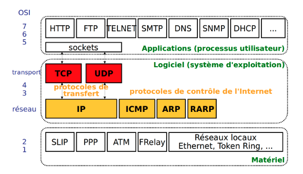
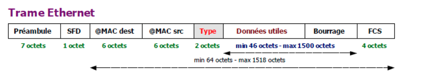

# Architecture TCP/IP:

Archi TCP/IP == L'ensemble des protocoles qui permettent de faire fonctionner un reseau internet.

### TCP/IP en 3 gros bloc (du plus haut au plus bas):

- (3) **Bloc Application**:
  - contient tous les protocoles applicatifs d'internet
  - s'exec dans les processus utilisateur, appelés **Clients/Serveur**
- (2) **Bloc logiciel**:
  - fait l'intermédiaire entre le apps qui font des demandes sur internet et le matériel qui permet la transmission physique.
  - dans ce bloc, les protocoles s'exec dans le système d'exploitation.
  - ex: TCP, IP, UDP. Ces **protocoles de transfert** permettent de transferer des données.
  - Dans ce meme bloc, on retrouve les **protocoles de controle** (ARP ou ICMP(permet de teste`ping`, `traceroute`)).
- (1) **Bloc matériel**:
  - permet d'envoyer les données de manière physique (carte réseau, souvent de type Ethernet ou WIFI).
  - ce bloc correspond aux différents moyen de liaison et permet d'envoyer des signals depuis une carte reseau vers une autre carte reseau.

Ici dans la figure ci-dessus, on voit que pour l'archi TCP/IP, on a une archi de l'OSI simplifier:

- Au lieu d'avoir 7 couches, on en a 3.
- Les couches 5, 6 et 7 sont fusionnées en une seule couche appelé: **couche application**.
- couche 3, 4 -> **couche logiciel**
- couche 1, 2 -> **couche matériel**

### Principaux protocoles applicatifs:

Tous les protocoles suivant font partie du **bloc application**.

- **HTTP** (HyperText Transfer Protocol):
  - faire dialoguer un nav web et un serveur web.
- **FTP** (File Transfer Protocol):
  - trasnférer des fichiers entre un client et un serveur.
- **telnet**:
  - permet de faire une connexion à distance, exec des commandes sur une machine distante.
- **rlogin**: pareil.
- **SSH**: pareil mais sécurisée, avec le chiffrement des communications.
- **SMTP** (Simple Mail Transfer Protocol): permet d'envoyer des courriers elec.
- **POP et IMAP**: permet la reception des emails, les recups sur un serveur et les lires.
- **DNS** (Domain Name System):
  - protocole applicatif, sans lui plus rien de fonctionne.
  - sert à faire la correspondance entre les noms des machines sur internet et leurs addresse internet (adresse IP).
  - carnet d'adresse des noms de serveur sur internet.
- **SNMP** (Simple Network Management Protocol):
  - pas utilisé directement pas les utilisateurs internet.
  - utiliser pour échanger des informations entre équipements réseau (surveillance de reseau, detection panne, etc...).
  - permet donc à un administrateur reseau d'avoir un outils de supervision.

#### Remarque:

**socket**:

- n'est pas un protocole.
- dispo dans tous les langages (ou presque), c'est une lib.
- permet à une app cliente ou serveur de faire ses demandes d'envoi ou de reception de message en utilisant TCP ou UDP.

### Protocoles TCP et UDP (Les protocoles de transfert):

#### Role de TCP?

- faire la **fiabilité** principalement.
- en **mode connecté**.
- réalise le **controle de flux**: permet de faire en sorte que les messages ne soient pas envoyés si le récepteur n'est pas pret à recevoir.
- réalise le **controle de congestion**: TCP n'envoie pas de donnée s'il y a congestion (cad, un point d'encombrement dans le reseau).

#### UDP?

- proto **plus simple**.
- **n'assure pas la fiabilité** des transferts.
- fait le liens entre l'application et IP de manière la plus simple possible sans aucun controle de fiabilité.
- bcp plus **rapide** que TCP.
- fait quand meme de **la detection d'erreur**: en faisant la **somme de controle**, mais ne fait **pas la retransmission**.
- **pas en mode connecté**
- les apps multimédia utilisent UDP.

#### TCP/UDP role communs:

- ils font le liens entre applications et le réseau.
- permettent l'envoie et la reception à travers des sockets.
- retenir qu’un numéro de port permet d’identifier de manière unique sur une machine donnée un programme client
  ou serveur qui utilise Internet.

#### Protocol IP (Internet Protocol):

- c'est le coeur de l'architecture d'internet.
- acheminer les messages depuis l'émetteur vers le récepteur.
- pour trouver un chemin, il met en oeuvre le **routage de paquet**.
- le routage ce fait de proche en proche (pour chaque étape, le routeur doit troiver son **prochain saut**).
- Les routeurs se basent sur les adresses IP pour prendre des décisions de routage. Chaque paquet IP est
  acheminé vers sa destination en fonction de l’adresse IP destination contenue dans l’en-tête du paquet.
- IP = identifie les machines,
  Sous format IPv4 (4 octets, s'écrit sous forme de 4 nb decimaux (0-255)) -> 132.227.71.30,
  Sous format IPv6 (16 octets, s'écrit sous forme de 8 hextets (1 hextet = 16 bits)) -> 001:0db8:3c4d:0015:0000:d234:3eee:000,
- **fragmentation**:
  - adapter la taille des paquets IP à la taille max des trames sur chaque liaison traversé
  - MTU (Max Transmission Unit): taille max du paquet IP q'une trame peut contenir.

### Protocole de controle de l'internet:

#### ICMP:

- Internet Control Message Protocol.
- faire des tests de connectivité sur le réseau.
- ping, traceroute -> ICMP.

#### ARP / RARP:

- **ARP**:
  - Address Resolution Protocol.
  - invisible aux utilisateurs.
  - fait le lien entre les adresse IP utilisées pour trouver une machine sur internet et les adresses des cartes reseaux.
  - adresse carte reseau = **adresse MAC**.
- **RARP**:
  - Reverse Address Resolution Protocol.
  - permet d’affecter des adresses IP à des cartes réseau lorsqu’elles n’en ont pas.
    Il est maintenant très peu utilisé et est essentiellement remplacé par le protocole DHCP

#### DHCP:

Dynamic Host Configuration Protocol.

Ce protocole permet à des machines connectées à un réseau de se voir attribuer une configuration réseau,
en particulier une adresse IP, par un serveur DHCP.
Ce serveur dispose d’un pool d’adresses qu’il peut mettre à disposition des machines du réseau qui en font la demande.
Si vous êtes relié à Internet grâce à une box, elle fait office de serveur DHCP.
Quand vous vous connectez au réseau chez vous, vous n’avez rien à configurer, le serveur DHCP de la box s’occupe de vous
transmettre la configuration réseau de votre machine ou de votre téléphone pour l’accès à l’Internet.

### Protocoles des cartes reseaux:

- permet transmission d'une trame correspondant à une seq binaire sous la forme d'un signal à une liaison donnée.
- proto les plus courant: WIFI, Ethernet, 3G, 4G, 5G.

#### Ethernet:

- permet d’envoyer des signaux électriques à partir d’une carte réseau sur un câble en cuivre.
- il y a des équipements d'interconnection, commutateur, hub, switch. Ils permettent de créer un reseau local.

**Trame Ethernet**:

- contient dans son en-tete: adresses MAC src et dest de deux carte reseau émettrice ou destinataire.
- ensuite, le champ **Type**: indique soit IP, soit ARP.
- à la fin de la trame ce trouve l'enqueue: stock FCS(Frame Control Sequence), c'est un checksum.

**taille min 64 octets.**: Pour la détection de collision.
**taille max 1518 octets**
**14 octets d'entete && 4 octets d'enqueue**
**généralement, IP/ARP min 46 octets, max 1500 octets**
**si paquet plus grand que 1500, IP le découpe en plusieurs paquet de 1500 octets**
**si plus petit que 46 octets, Ethernet ajoute du bourrage, octets artificiels pour atteindre 46 octets**
