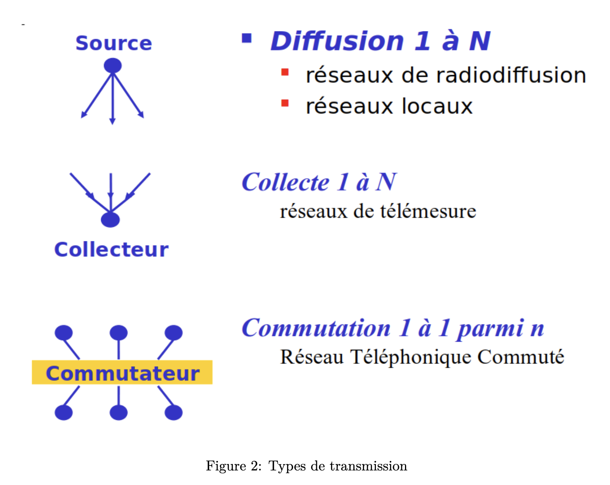
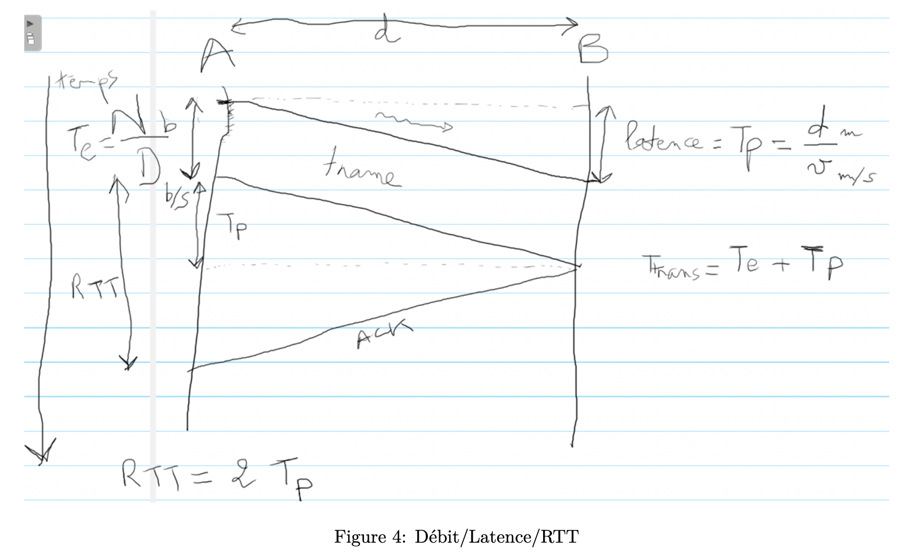
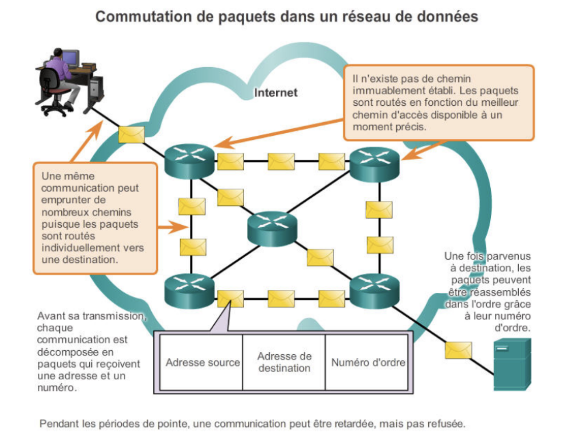
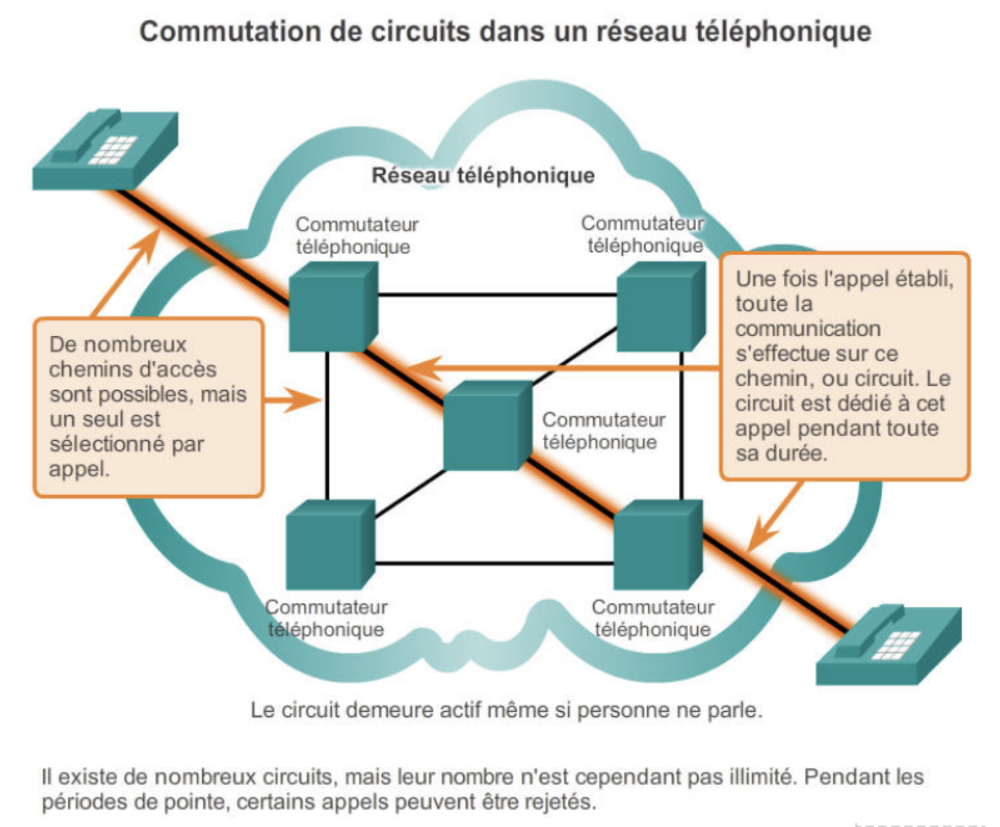
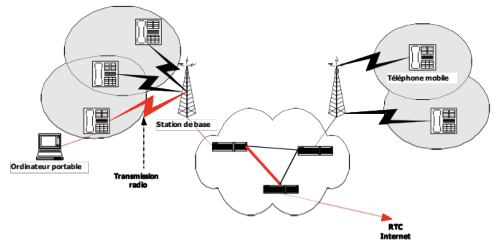

### Partie A:

## Fiabilité

Fiabilité d'un reseau (4 critères): 1. Arrivée des données sans erreur, 2. Sans perte, 3. Dans l'ordre, 4. Sans duplication

La fiabilité n'est pas une contrainte forte pour les vidéos, images, sons. Cependant, elles doivent arriver à la bonne vitesse pour etre lue correctement par l'humain.

Ex: Streaming -> bufferiser en avance.

## Conclusion

Conclusion sur la contrainte de fiabilité: Dépends des besoins relatives aux différentes application.

Reseau (archi générale): Application -> Transformation de l'info en séquence binaire -> Elles-meme transformée en signal. (Avec des protocol/algo/electronique).
Les protocol/algo/electronique sont présent dans la carte reseau.

## Protocole

C'est à la fois un algo, et aussi une transmissions des entetes des info permettant de realisé l'algo.

## Telecommunications

Toutes les techniques pour transmettres de l'info sur des liaisons (filaire, radio, optique, satelite)

## un Reseau concretement

Ensemble des ressources qui permettent de réaliser la transmissions de l'info (carte reseau, cable, répéteurs, commutateurs, routeur, terminal)

## Equipements terminaux:

Principalement, téléphone/ordi/tablette (Dans un reseau, c'est le point in/out d'un réseau).

## Role du commutateurs:

Mettre en relation par liaisons filaire (le plus souvent), les différents membre du reseau.

## Reseau privé:

Utilise un reseau public déjà déployé, met pour faire transiter dans l'espace restreint -> VPN (Virtual Private Network).

## Reseau Dorsal:

Coeur du reseau, tout transite par lui.

## Classification d'un reseau

## 4 critères:

## Type de transmissions:

- Différents supports physique: File de cuivre, Fibre optique, Onde radio, Satellite

- Taille:
  - Différentes étendue géo:
  - PAN (Personal Area Network): Très courte (en mètres), ex: Bluetooth
  - LAN (Local Area Network): Un peu plus grand (10zaine de mètres, km)
  - MAN (Metropolitan Area Network): Reseau de zone metropolitaine (10zaine de kms), ex: relier campus universitaires
  - WAN (Wide Area Network): Grande distance (100taine, millier de kms), géré par des opérateurs de communications.
    -> Internet est l'interconnexion de tous ces types de réseau.

- Perf:

  
  - débit (ou bande passante): Qté d'info qui peut etre transférée sur une période, exprimé en bit/s (bps).
    débit++ -> Reseau rapide.
  - latence (tps de propagation): Tps pour premier bit de la source a la dest. Exprimé en ms ou µs.
    --latence -> Reseau rapide. - Exemples:
    -> PAN: latence faible, car courte distance à parcourir.
    -> Satellite: latence élevé, car longue distance.
    -> Reseau optique: vitesse de propagation proche de celle de la lumière, débit eleve. - latence dépend de la distance parcourue, car tous les supports +/- la meme vitesse (proche de celle de la lumière). - debit, mesure la capacité de transmission des infos d'une carte reseau. - RTT (Round Trip Time): - mesure le temps qu'il faut à un bit pour effectuer l'aller/retour entre deux equipements. - permet de verif si une trame de données à bien été recu, grace à la notion d'acquittement. - RTT = 2 fois le temps de la propagation. (distance facteur important).
    -> RTT = 2 \* Tp
    -> Temps de transmissions Total = Ttrans; Temps émission d'un trame = Te; Temps de propagation (latence) = Tp; ACK = acquittement; D = débit de liaison en bits
    -> d = distance parcourue par le signal en mètre; v = la vitesse de propagation du signal en m/s
    -> Ttrans = Te + Tp  
    -> Te = Nbits / D; Tp = d / v

## Types de terminaux: - Reseaux d'ordinateur:

- Ici, on fait ref directement à internet, Reseau d'ordi === Internet.
- Les clients envoient des requetes à des serveurs pour obtenir un service ou une application. Internet fonctionne grace à la commutation de paquets

- L'unité de transmission dans le reseau, c'est les paquets.
- C'est "l'enveloppe" qui circule dans le reseau. Il est composé d'un num de séquence, une addresse dest et une addresse src.
- Les équipements intermédiaire qui assure le routage de ces paquets, ce sont les Routeurs.
- Reseaux téléphoniques:

  
  - Ici, lorqu'un appel est passé, un circuit est reservé entre l'appelant et l'appelé.
  - En gros, on réserve sur chaque liaison traversée et dans chaque commutateurs une bande passante suffisante pour acheminer le signal de la voix sans ralentissement.
  - Le chemin de données est donc établi une fois pour toute avant le début de la communication.

- Reseau sans fil:
  
  - Ex: réseaux mobiles, WIFI
  - Les équipements terminaux (ex: ordi, tablette, tel) se connectent à des antennes (appelé station de base ou borne WIFI), grace à une carte reseau 4G/5G, WIFI.
  - Donc, les équipements terminaux se connectent aux antennes (communications sans fils), et les antennes sont connectées au réseau filaire.

## Aperçus industriels (Le marché des télécommunications):

- 3 types de principaux acteurs:
  - Les opérateurs: Possèdent et gèrent les réseaux.
    - Les constructeurs: Produisent les équipements de télécommunication.
      - Les fournisseurs de services: Offrent des services (envoie de courriels, accès internet, hébergement de serveur web, etc...).
