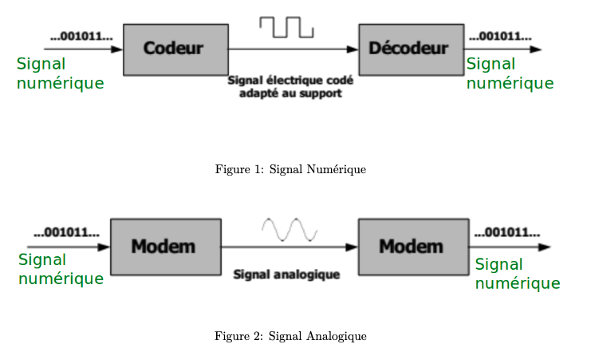
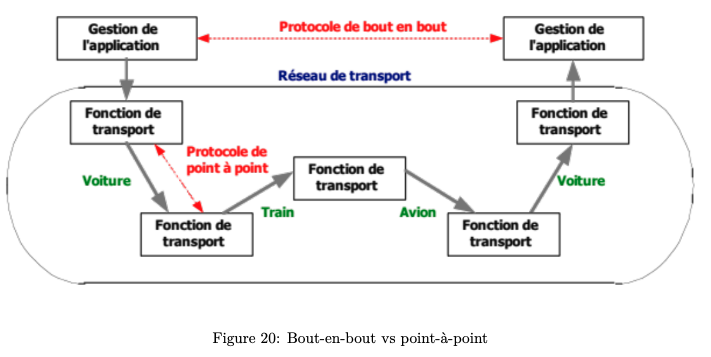
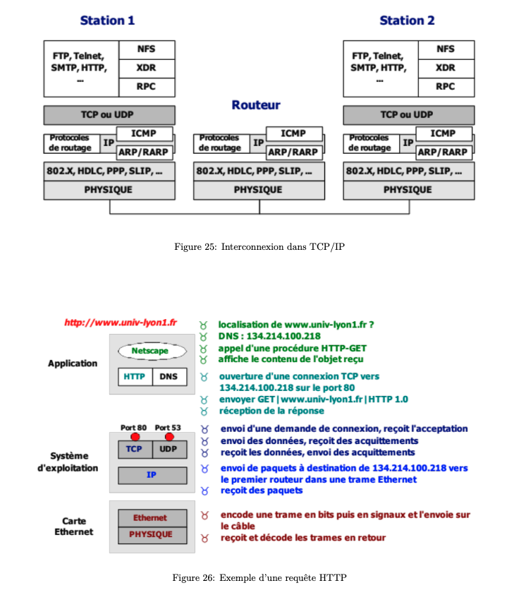

# Architecture en couches

Transmission de l'information, c'est quoi une liaison? Les supports de transmission?

## Transmission de l'information:

- 2 grandes catégories de transmission:
  - (données multimédias (son, image, vidéo))
  - données discret et finis (ex: un fichier de n'imp type):
    - ce fichier a un debut et une fin, il peut facilement etre traduit en séquence binaire.
  - données continues: correspond a la variation continu d'un phéno physique comme la voix, temp, lumière, etc...

Quel que soit le type de données, on doit se ramener à une séquence binaire avant de générer un signal adapté au support de transmission.
Et donc à l'inverse quand un support reçoit la séquence binaire il doit faire la conversion inverser pour avoir le signal analogique.
Op donnée -> seq binaire ==> Codage
op seq binaire -> donnée ==> Decodage

### Techniques de transmission:

#### (Figure 1) Méthode "transmission en bande de base":

La carte réseau utilise un codeur et un decodeur. Permettant la traduction la seq binaire en un signal qui circule sur le cable Ethernet.
La carte reseau peut transmettre le signal electrique sur un support en cuivre. Méthode relativement simple.

#### (Figure 2) Méthode "transmission par modulation du signal analogique sur la liaison":

Transmettre un signal analogique modulé sur a la liaison. (utilisée pour transmettre des signaux sans fil à des fréquences diff).
avtg: transmettre +sieurs signaux dans un meme espace grace a des fréquences diff. Couvre plus grand distance (+km).

#### liaison

1 carte reseau ---------- liaison ---------- 1 carte reseau

On a bien une carte reseau de chaque coté de la liaison. Et un support de transmission entre les deux.
En gros la carte reseau prend un seq binaire (provenant de l'app, ou équipement) et génère le signal adapté au support de transmission.

### Supports de transmission:

- cable en cuivre (connecteur RJ45 === port Ethernet):
  - distance: paire torsader < cable coaxial (meilleur débit)
- fibre optique:
  - transmission d'onde lumineuse (30km de porté sans répéteur, encore meilleur débit)
- antennes: reseau sans fil (WIFI, reseau mobile, reseau tv, radio)
- satelite:
  - debit élevé / latence très faible
  - cout élevé

Ils peuvent tous subir des interférences pendant leurs transmission provoquant des erreurs.
Erreur == quand un bit change de valeur pendant la transmission.

**Dans un reseau**:

- Équipement terminaux (ordi, imprimante) != Équipement intermédiaire (routeurs, commutateurs, borne WIFI, pare-feu, répéteurs)
- Les différents supports de transmissions (liaison sans-fil, filaire local (LAN), longue distance (WAN), fibre optique, satellite).

### Modes de transmissions:

**full-duplex**: deux cartes reseau peuvent envoyer et recevoir des signaux simultanément. (reseau sans-fil / filaire).
**simplex**: ne permet l'envoi de signaux que dans un seul sens. (antennes de radio et de television, pas capable de transmettre des données).
**half-duplex**: possible d'envoyer **ou** de recevoir des signaux mais pas simultanément.
**liaison point-à-point**: il n'y a que 2 cartes reseau qui communiquent entre elles sur une seule et meme liaison.
**liaison multipoints**: plusieurs carte reseau qui communiquent sur le meme support de transmission. (+sieurs ordi sur borne WIFI).

- 2 problématique de la **liaison multipoints**:
  - nécessaire d'attribuer des adresses uniques aux différentes cartes reseau pour identifier les équipements qui communiquent entre eux
    et savoir quelle carte reseau émet le signal et quelle carte reseau doit en etre destinataire.
  - il faut gérer le partage du support de transmission, qui a le droit d'émettre.

### Différentes topologies de liaison:

**Topologies**:

- **le bus**: consiste à une liaison multipoints avec plusieurs ordinateurs ou cartes reseau, toutes relié par un unique support de liaison, le **bus central**.
- **en étoile**: équipement central, auquel sont reliées les cartes reseau. (utilisé pour les reseau locaux, ex: box, wifi)
- problème commun aux deux de dessus: si l'équipement intermédiaire tombe en panne, plus de reseau.
- **en anneau**: chaque équipement est relié à deux autres équipements, le précédent et le suivant.
- **maillée**:
  - chaque équipements est relié à +sieurs autres.
  - on a donc +sieurs chemin possible entre deux équipements.
  - en cas de panne on a des alternatives de chemin.
  - souvent utilisé en reseau, pour avoir de la redondance et de la tolérance à la panne.
  - cout élevé
  - si chaque équipement relié à **tous** les autres alors => **topologie maillée totale**. O(n^2) si n équipements.

## Les architectures protocolaires:

ex: Archi TCP/IP fait fonctionner internet.

### Architectures en couche et encapsulation:

**modèle de référence OSI (Open Systems Interconnexion)**: rassemble dans une seule archi, toutes les bases présentes dans tous les reseau.
**architecture protocolaire**:

- les protocoles applicatifs: definit pour chaque appli, comment elle doit échanger des données.
- les protocoles de transport: permet de définir comment transporter l'info d'un émetteur à un récepteur.
- les protocoles de liaison: proche du matériel et servent à transmettre un signal sur une liaison de transmission.
- Tous exec, dans l'app, le syst. exploit. et la carte reseau.

### Protocole:

- **HTTP**: gère les requetes et les reponses pour échanger avec des pages web.
- **IP**: nécessaire pour la plupart des applications.
- **TCP**: assure la fiabilité des transmissions.
- **DNS**:
  - utilisé pour nommer les machines sur internet, en particulier les serveurs.
  - toutes les applications font appel au DNS pour trouver les adresses IP associées aux noms de serveurs.
  - se trouve dans un couche séparée, pour prévoir une éventuelle évolution de ce protocol.
- **adresse MAC**: identifie lees cartes reseau.

- **Archi en Couche** (3 principales):
  - les couches applicative (un proto pour chaque application)
  - la couche de transport (determine le chemin a suivre)
  - la couche de transmission (gère la transmission physique des données sur le réseau)
  - **encapsulation**:
    - Les données de la couche N sont l'entete de la couche N + 1 + les données de la couche N + 1.
    - En gros, on a: **Dn = Hn+1 + Dn+1**
    - Pour detecter les erreurs on utilise le **checksum**:
      - calculé sur l'émetteur sur les données avant l'envoi et envoyé au récepteur
      - ensuite lorsque les données arrivent en réception, nous refaisons le meme calcul sur les données reçus et comparons
        le checksum avec celui d'avant.
      - pas d'erreur ? return OK (msg d'acquittement ACK) : return not-OK;

- **2 type de protocoles** (cf voir figure "bout-en-bout vs point-à-point"):
  - **bout en bout**: s'exec uniquement aux extrémités du réseau, c-a-d sur les équipements terminaux de l'user (ex: nav web, app, serveur web, tel pour appel).
  - **point-à-point**: s'exec également sur les équipements intermédiaires (répéteur, borne WIFI, box, commutateurs, routeur, pare-feu)

exemple bout en bout: proto applicatifs tq HTTP, ainsi que TCP et UDP.
exemple point-à-point: IP car il s'exec sur tous les routeurs traversés.

## Le modèle de référence - OSI:

le modèle théorique qui décrit le fonctionnement d'une architecture réseau dans son ensemble.

- 7 couches:
  - 7. **couche application** (la plus haute):
    - gère le dialogue entre le processus client et le serveur.
    - exemple: HTTP sur internet permet de demander une page web à un processus serveur qui héberge cette page web.
  - 6. **couche presentation**: transforme les données provenant d'apps, comme pour des raison de secu en utilisant le chiffrement SSL sur internet.
  - 5. **couche session**:
    - permet de créer des point de reprise pour les apps qui en ont besoin
    - par exemple, interrompre/reprendre un transfert.
  - 4. **couche transport**:
    - assure la fiabilité du transfert
    - garantissant que tout ce qui arrive à destination corresponde à ce qui initialement été émis
    - veille a qu'il n'y est pas d'erreur.
    - au niveau de internet c'est TCP
  - 3. **couche réseau**:
    - détermine par ou les paquets vont passer pour aller d'un point à un autre dans le reseau.
    - utilise les adresses spécifiques à chaque architecture réseau.
    - ex: Il s'agit des adresses IP sur internet, du numéro de tel dans le reseau telephonique.
  - 2. **couche liaison**:
    - s'occupe de l'interface entre deux cartes réseau et de la gestion du dialogue sur une liaison multipoint.
    - pour cela elle utilise les adresse des cartes réseau: les adresses **MAC**.
  - 1. **couche physique** (la plus basse): transmission d'une seq binaire sur un support de transmission.

**Couche point-à-point**: couche 1, 2, et 3. Donc s'exec tant sur les équipements terminaux que sur les intermédiaires.
**Couche bout à bout**: couche 4, 5, 6, et 7. s'exec sur les équipements terminaux.

- **unité de transmission**:
  - **trame**: unité de transmission au niveau de la carte reseau, ou plus précisément de la couche liaison.
  - **paquet**: unité de transmission au niveau de la couche reseau, on parle de paquet IP.
  - Et pour les couche sup, on parle de **message**.

Chaque couche du modèle OSI ajoute son en-tete sauf la couche 1.
En revanche, pour la **couche 2**, on ajoute également:

- un enqueue: permet de stocker le **checksum**
- en fin de trame parce que c'es seulement une fois avoir vue toutes les données que le calcul de checksum est terminé et ajouté a la fin de la trame.

**Mode connecté vs Mode non-connecté**:

- Presque tous les protocoles sont en mode non-connecté.
- mode connecté: en gros avant de transmettre des informations, on doit d'abord demander si cette dernière est d'accord pour les recevoirs.
- (le seule en mode connecté) TCP assure la fiabilité alors est en mode connecté.
- en mode non-connecté, on dit qu'on dans un mode **best-effort**, on ne sait pas si les données arriveront.

# Pour terminer voici un resume global de l'archi TCP/IP et un exemple d'une requete HTTP:

