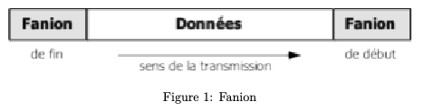
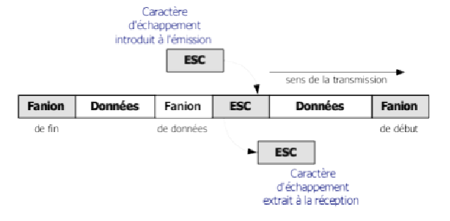
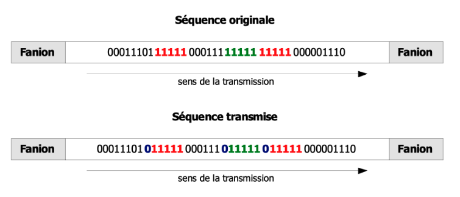
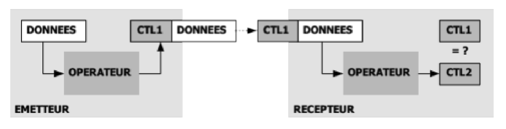
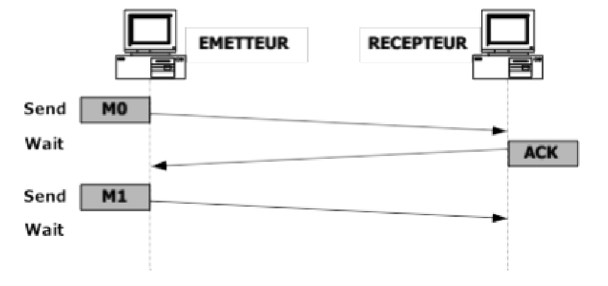
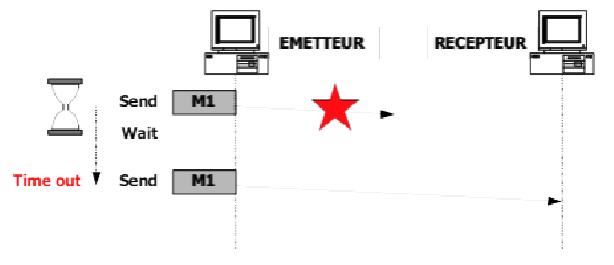
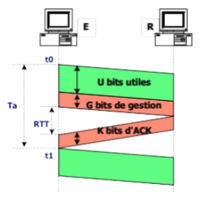

# Fiabilité des protocoles:

## La délimitation des données:

### Protocole et fiabilité:

Protocole de communication: détermine comment deux entités peuvent échanger des informations et communiquer entre elles.

### Notion de fanion

Comment definir le début et la fin du trame?

- le fanion, un caractère spécial pour définir le début et la fin de la transmission.
- le fanion: C'est un séquence binaire prédéfinie par le protocole de la liaison, signifie "début || fin de trame".

### Notion de transparence: l'échappement:

Le caratère d'échappement se positionne devant tout caractère nécessitant etre echappé dans les données transmises.
Et donc le caractère qui a été echappé, reste simplement une donnée dans les données transmises.

À quoi ça sert?

- fanion pose un problème lorsque cette séquence binaire se retrouve à l'intérieur des données transmises.
- car dans ce cas elle ne doit pas etre interpréte commme "début || fin de trame".

### Technique du bit de bourrage:

Pour assurer la transparence au niveau d'une trame, on utilise souvent la technique du **bit de bourrage**.
Consiste a casser le fanion plutot que de l'échapper.

Le caractère fanion: 01111110
Donc il suffit d'empecher qu'il y 6 bits à 1 consécutifs dans les données.
Pour ce faire on ajoute un 0 a chaque fois que la séquence binaire 0 suivie de 5 bits à 1, ainsi on évite d'avoir la séquence du fanion.

## Le controle d'intégrité:

En gros, c'est comment détecter les erreurs qui peuvent survenir lors de la transmission de données.

### Notion d'erreur:

Erreur == un bit change de valeur pendant sa transmission.

**Taux d'erreur binaire** = **BER** (Bit Error Change) = proba pour qu'un bit chaange de valeur pendant sa transmission.
**proba pour qu'un bit soit correct** = 1 - BER
**proba pour n bits soit correct** = (1 - BER)^n
**proba qu'une trame soit erronée** = 1 - (1 - BER)^n
Plus une trame est grande, plus est susceptible de subir une erreur, et donc d'etre erronée à la reception.

### Détection d'erreur:

on doit disposer d'un élément de comparaison: **la détection par répétition**:

- consiste à envoyer le messages en double depuis l'émetteur ou à demander au récepteur de renvoyer un echo du message
- peu efficace, bcp de bande passante

on utilise un méca plus sophistiquer:

- le **checksum**:
  - voir précedent cours pour le checksum.
  - voir figure "detection d'erreur par clé calculé"

### Le mode Send&Wait:

Le checksum est nécessaire pour verifier qu'il n'y est pas d'erreurs dans la trame.
Mais ce n'est pas suffisant:

- Il faut aussi verifier qu'il n'y est pas de perte de données
- que le messages arrive dans l'order dans lequel il a été envoyé
- et sans duplication.

Principe de base:

- en cas de perte/erreur:
  - on retransmet le message, mais pour cela il faut le conserver sur l'emetteur de chaque message envoyé
  - et cela jusqu'à accusé de reception (ACK).

On envoie le message et on attend de recevoir l'accusé de reception.
Tant que l'on a pas recu l'ACK alors on ne peut pas envoyer le message suivant.

Mais si le message n'arrive jamais? Quand déclencher la retransmission?

- Pour cela, l'émetteur déclenche la **temporisation** (timeout), par ex: 10sec, si pas ACk alors on retransmet.

une tempo trop courte ou trop longue pose problème de duplication, la tempo doit etre de l'ordre du RTT (temps aller-retour d'une transmission).

Donc, reprenons les mécanismes pour garantir la fiabilité:

- somme de controle pour detecter les erreurs.
- stockages des messages non acquité.
- accusé de reception.
- retransmission et temporisation de retransmission.

On va rajouter la **numérotation des messages**:

- afin de detecter les duplicata
- mais aussi de remettre dans l'ordre les messages qui arrivent dans le désordre.
- on introduit donc **NS** (pour 'send') pour compter les messages envoyés.
- NS figurera dans l'entete du message.
- et idem pour les messages reçu: NR, on peut donc désormais compter le nombre de messages correctement reçu.
- NR, permet de numéroté les accusés de reception.

if(NS < NR): par exemple, le messages n°2 est reçu alors que le messages n°3 est attendu.
if(NS > NR): par exemple, le messages n°4 est reçu alors que le message n°3 est attendu. (situation, msg perdue ou pas encore arrivée == msg arrivent dans le désordre).

### Amélioration du "send&&wait":

**piggybacking**:

- cela consiste à inclure les confirmations (ack) dans des messages contenant des données (on économise des confirmations).
- donc dans chaque trame normalement on passe le NS en en-tete eet bas on rajoute aussi le NR attendu.
- quand tout ce passe bien il permet de ne jamais envoyé de confirmation explicite.

### Efficacité d'un protocole:

Dans un protocole quand on parle d'efficacite, c'est en générale mesurer les pertes de temps liées à la mise en oeuvre de la fiabilité.
Ils y a les données utilies et non utile (c'est elle qui nous font perdre du temps.)

Reprenons l'exemple de la figure "efficacite d'un protocole" ci-dessus:

- Cette trame contient **U bits utiles**, **G bits de gestion** (c'est la taille de l'en-tete).
- Pour garantir l'arrivée correcte du message, il faut confirmer sa reception. La confirmation contient **K bits non utiles** (msg créer par le proto lui-meme).
- En général, la taille de la confirmation est égale à l'en-tete: **G = K**
- Le temps de transmission de la confirmation est le RTT (temps aller-retour).

**efficacité (en %)** = U / (U+G+K+D*RTT)
D: le débit, D*RTT: correspond au temps perdue à attendre la confirmation (en nb de bits)
N=U+G+K (tous les bits réellement transmis jusqu'à la reception de la confirmation).

**Remarque:**
Nous distinguons donc le débit maximum théorique ou débit nominal qui est le débit initial sur la
liaison, du débit utile ou débit réel, qui représente le débit réellement observable par l’utilisateur du
réseau par exemple en mesurant avec sa montre le temps de téléchargement d’un fichier.

Pour intégrer les erreurs dans le calcul de l’efficacité, nous pouvons considérer la probabilité de recevoir
correctement une trame, qui est (1-BER)^N, où BER est le taux d’erreur binaire et N est le nombre de
bits transmis.

### Protocoles à anticipation:

Pour améliorer l'efficacité, il y a aussi l'anticipation.

L’anticipation consiste à envoyer plusieurs messages de manière consécutive, sans attendre la réception des
accusés de réception des messages précédents. Cela permet de gagner du temps en évitant les délais liés à la
transmission des accusés de réception (fonction du RTT). Cependant, cette technique nécessite une fenêtre
d’émission suffisamment grande pour stocker tous les messages envoyés non encore confirmés.

Plus le RTT est élevé, plus la fenêtre d’émission
doit être grande. Plus le débit est élevé et plus le temps d’émission sera court, ce qui implique également
une fenêtre d’émission de grande taille.

- Un autre mécanisme: **Gestion sautante de la fenetre && Gestion glissante de la fenetre**
  Un autre mécanisme permettant d’améliorer l’efficacité est la gestion sautante de la fenêtre. L’objectif
  est toujours d’économiser les acquittements en ne confirmant pas chaque message dès sa réception. Par
  exemple, TCP ne confirme que tous les trois messages. Ainsi, le protocole attend d’avoir reçu M0, puis M1,
  puis M2 avant d’envoyer ACK NR=3. Dans l’en-tête, il y a le numéro du message attendu NR et l’émetteur
  qui reçoit la confirmation saura que les trois messages précédents ont bien été confirmés et qu’il peut vider
  sa fenêtre. Si la fenêtre peut contenir au maximum trois messages et que l’on ne confirme que tous les trois
  messages, on envoie M0, M1 et M2, puis on est bloqué jusqu’à ce que l’on reçoive la confirmation ACK NR=3.
  On envoie alors M3, M4 et M5, puis on est de nouveau bloqué jusqu’à ce que l’on reçoive la confirmation
  ACK NR=6. Et ainsi de suite. C’est pourquoi on parle de gestion sautante de la fenêtre. À l’inverse, si chaque
  message reçu est confirmé aussitôt, on parle de gestion glissante de la fenêtre. On envoie M0, puis M1
  et M2, mais avant d’envoyer M2, on reçoit la confirmation de M0 qui retire M0 de la fenêtre d’émission
  permettant ainsi l’envoi de M3 après M2. Et ainsi de suite. La gestion glissante de la fenêtre est donc plutôt
  comme un tourniquet.
  Le plus efficace est la gestion sautante de la fenêtre, mais avec une fenêtre suffisamment grande pour ne pas
  être bloqué en émission. Cela dépend donc de la taille optimale de la fenêtre. Même si l’on ne confirme que
  tous les trois messages, il faut être en mesure de continuer à anticiper et donc de ne pas perdre de temps
  dans l’attente de l’acquittement. Dans l’exemple ci-dessus, il faut donc une fenêtre plus grande que trois
  messages pour être plus efficace.

- Le dernier mécanisme d'optimisation est le **rejet selectif**:
  (Voir cours page 15-16 cour 1c)

  ##### (A FINIR)
